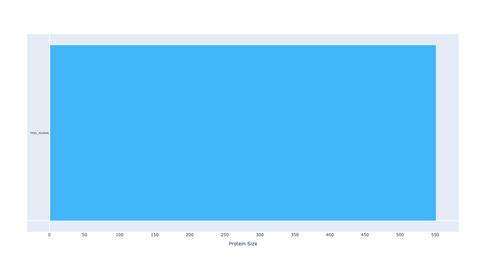

# uniprotProteinViewCharm

This is the python port of uniprotProteinView R package, found [Here](https://github.com/zzaassaa2/uniprotProteinView).

The goal of uniprotProteinViewCharm is to provide a means to show a graphical representation of the UniProt data, and allow easy cross-comparison of features between different proteins for easy analysis of protein features.

The package makes use of the plotly package in order to draw.

# Installation

To download the package:

```

```

# Overview

The uniprotProteinView package provides one primary function, `drawProteins()`. The simplest usage, using the protein [Q04206](https://www.uniprot.org/uniprot/Q04206), is:

```
import uniprotProteinViewCharm as up

up.drawProtein("Q04206")
```

This will draw the base, main chain of the protein onto the plot, as shown below, with a random color.

<div></div>

A more advanced usage being:

```
import uniprotProteinViewCharm as up

up.drawProtein(proteins=["../Q04206.xml", "random number:2"], 
            types=dict(type=['domain', 'region of interest'], colors=['red', 'green']), 
            descriptionSearch='phos', 
            offsetSearch=dict(type='helix'))
```

<div></div>

The user can also specify using random:

```
import uniprotProteinViewCharm as up

# This will draw a random protein chain
up.drawProtein('random')

# These will both draw 3 random proteins, using alternative formats
up.drawProtein('random number:3')
up.drawProtein('random|number:3')

# This will draw three random mouse proteins. By default, orgid is set to 9906 - human
up.drawProtein('random|number:3 orgid:10090')
```

To draw features, there are three ways. Each protein has a list of features associated with it. Each feature has a type name and description. The user can search by match with type name, if the description contains a string, and/or by type name match, however these will be offset.
The offset features will be displayed above the protein chain it is associated with.

```
import uniprotProteinViewCharm as up

# These all are alternative formats to draw three randomly colored human proteins, and draw the domain feature, if present
up.drawProtein(proteins='random|number:3',
            types='domain')
up.drawProtein(proteins='random|number:3',
            types=['domain'])
up.drawProtein(proteins='random|number:3',
            types=dict(type='domain'))
            
# These are alternative formats that will draw three random proteins, with the features domain and region of interest, if present
up.drawProtein(proteins='random|number:3',
            types=['domain', 'region of interest'])
up.drawProtein(proteins='random|number:3',
            types=dict(type=['domain', 'region of interest']))
            
# This uses type search, description search, and offset type search to draw different features onto three random proteins.
# 'types', 'descriptionSearch', and 'offsetSearch' all take in the same input, the different is what they do with it.
up.drawProtein(proteins='random|number:3',
            types=['domain', 'region of interest'],
            descriptionSearch='phos',
            offsetSearch=dict(type='helix')
            )
```

Color can be specified by adding the `colors` name to a dictionary and giving it either a string, or an array of strings.
As shown in the below example. The user can also use a similar format to that of proteins, by using the random keyword. This format applies to all features as well.

```
import uniprotProteinViewCharm as up

drawProtein(proteins=dict(type=['Q04206', 'random|number:3'], colors=['random number:2', 'red']),
            types=['domain', 'region of interest'],
            descriptionSearch='phos',
            offsetSearch=dict(type='helix')
            )
```

To Specify the title, use the `title` parameter. To prevent the showing the of the progress bar set `showProgress` to False.

# Acknowledgments 

This package makes use of [plotly](https://plotly.com/python/) for Python.